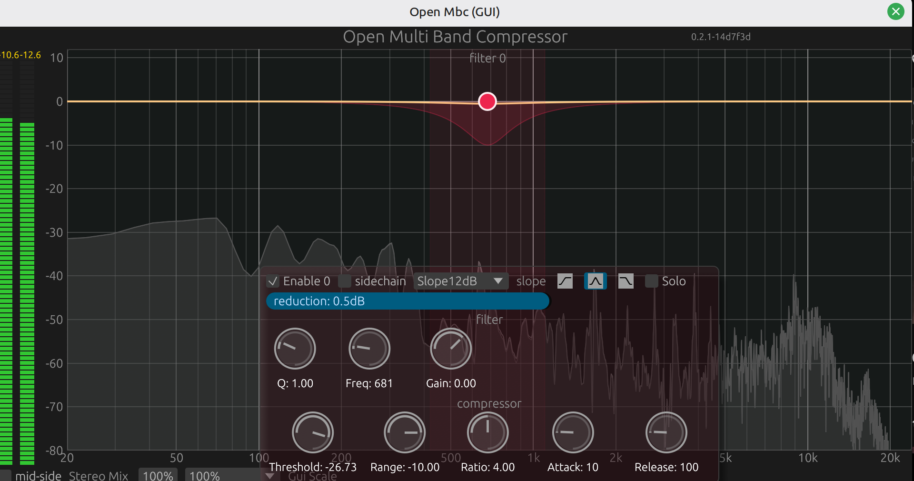
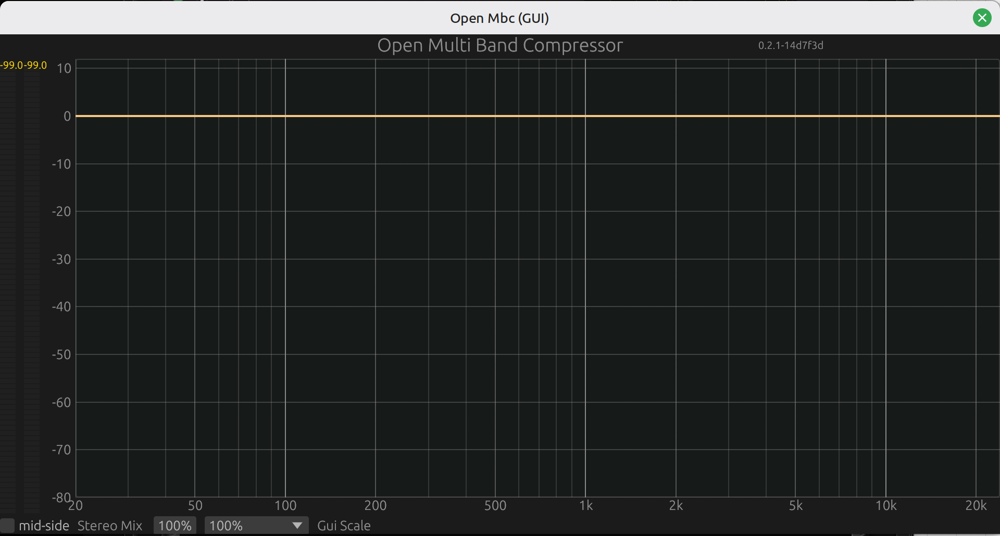
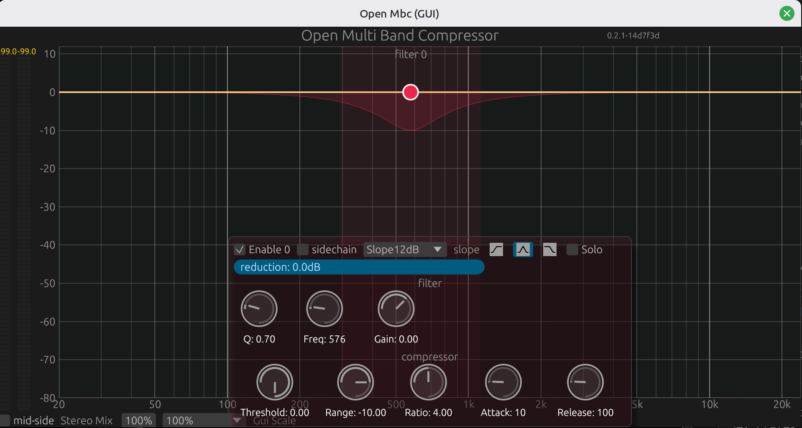
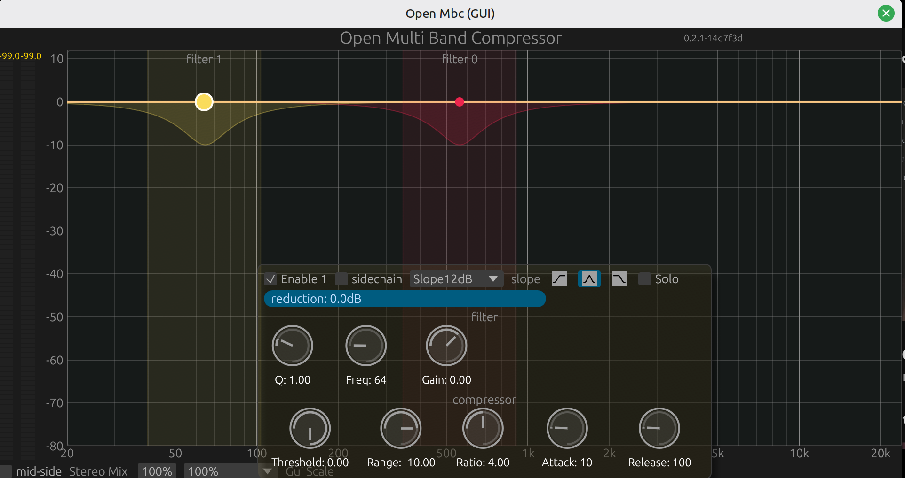
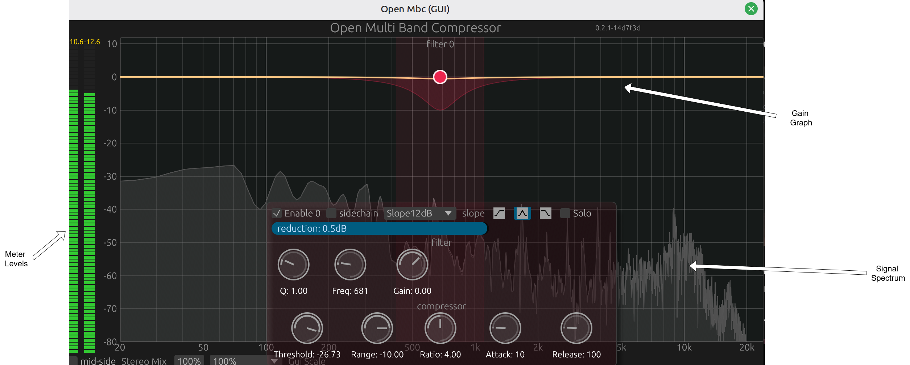

# Open Mbc
Open Multiband compressor! 
for all your multiband compression needs



## Why?
I know how its like, there are many good plugins around but a lot of them cost money
one of my favorite is a multiband compressor, it helps with controlling bass when coming kicks and bass guitar
I didn't feel like I wanted to spent 200$ on a single plugin...

so I built one!

## How to Install
Open MBC uses a versioned release cycle, you can go to this [link](https://github.com/maor1993/open_mbc/releases/tag/) or the releases in github

The release has a VST3 you can copy to your plug-in folder
* choose your operating system (MacOS,Windows,Linux) and 
* download the relevant zip
* copy `Open Mbc.vst3` to your vst plugin folder
* Enjoy!


## How To Use
### Basic Usage
When you open the plugin you'll see a spectrum and a flat line.

clicking on the line lets you place a compressor band 



You can set:
* Center Frequency
* Width (In octaves)
* Make up Gain
* Compressor Threshold
* Compressor Max Allowed Compression
* Compression Ratio
* Attack
* Release
* Filter type (bandpass, low/high shelf)
* Filter Intensity (12/24/36/48dB slope)


Clicking again on the line will create an additional compressor band



Clicking on the previous band will change back to the bands settings 


**Note - The current maximum bands you can set is 5**


### Modifying settings

* you can click each knob to manually set the value 
* you can double click a knob to reset the knob to the default value
* you can drag the filter on the graph to see the coresspoing musical note

### Visuals 
there are 3 main visuals you get with Open MBC




#### Spectrum
The spectrum line shows the input signal spectrum in **White** , and the output spectrum in **Dark Gray**

#### Gain Graph
The main line where you place your bands will show you the current compression being performed on the spectrum

#### Meter Levels
The stereo meter will show the output levels of the signal, reaching Red means your output signal is  **>0dB**


### Side Chain
every Band can have its compression test signal be either from the input or from the sidechain

to activate the sidechain mode, click the side chain button on the compression panel

you'll need to enable the second stereo pair in your DAW and send it your 


### Additional options 
* you can choose if the plugin should process using mid-side by clicking the button on the bottom left

* the compression for stereo signals is measued with the average of the two channels, you can control this blend by setting the stereo mix %, also on the bottom left.

* you can click **solo** on one of the bands to hear what the compressor is hearing


## Building

you can compile Open Mbc to a vst3 with:

```shell
cargo xtask bundle open_mbc --release
```

for local debugging in linux you can use `pw-jack` to run the plugin in your main audio backend

I used [carla](https://github.com/falkTX/Carla) 


to do so perform the following steps:
```sh
#build the project
cargo build

# run the plugin in debug mode with jack backend and buffer size of 1024
pw-jack -p 1024 ./target/debug/open_mbc -b jack

# in a seperate terminal
pw-jack carla
```


## Thanks
* [nih-plug](https://github.com/robbert-vdh/nih-plug) - the platform for the entire plugin backend 
* [Squeezer](https://github.com/mzuther/Squeezer) - C++ based compresssor used for some logic debugging
* [RSCuteDSP](https://github.com/CuteDSP/RSCuteDSP) - a rust version of the signalsmith DSP C++ library
